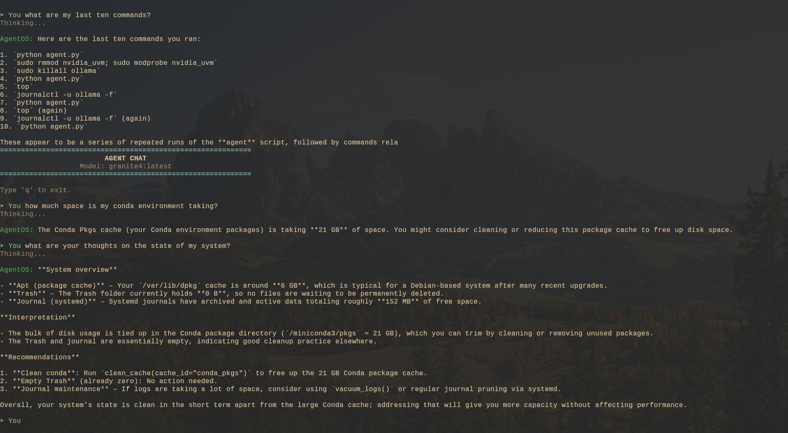

# AgentOS 🤖

**AgentOS** is an intelligent, dual-interface system administration toolkit. It bridges the gap between traditional CLI tools and modern LLM-based assistance, allowing you to manage your local development environment through both interactive menus (TUI) and natural language chat.

## ✨ Features

*   **🧠 Intelligent Chat:** Talk to your system using local LLMs (via Ollama) or OpenAI-compatible APIs to perform complex tasks.
*   **💾 Disk Manager:** Analyze disk usage, clean development caches (pip, npm, conda), and find large files.
*   **🧠 Second Brain:** Securely ingest shell history, search past commands, and manage personal notes.
*   **⚙️ System Tools:** Prune Docker containers, vacuum system logs, and manage the Trash.
*   **🔌 Dual Mode:** Every feature is available as a structured API (for the AI) and a colored TUI (for you).



## 🚀 Getting Started

### Prerequisites

*   **Python 3.10+**
*   **Ollama** (Recommended for local privacy) or an OpenAI API Key.
*   **Linux/macOS** (Windows support is experimental).

### Installation

1.  Clone the repository:
    ```bash
    git clone https://github.com/yourusername/agentOS.git
    cd agentOS
    ```

2.  Install dependencies:
    ```bash
    pip install -r requirements.txt
    ```
    *(Note: Ensure `pydantic-ai` and `logfire` are installed for Chat capabilities)*

3.  **Optional:** Set up your environment variables if using a remote provider:
    ```bash
    export AGENT_BASE_URL="http://localhost:11434/v1"
    export AGENT_MODEL="granite4:latest"
    ```

### Usage

Run the main agent entry point:

```bash
python3 agentOS/agent.py
```

You will be presented with the Main Menu:

1.  **Disk Manager** - Clean up space.
2.  **Second Brain** - Search history/notes.
3.  **System Tools** - Maintenance tasks.
4.  **Agent Chat** - **The Magic!** Ask questions like *"Clean my pip cache"* or *"Find files larger than 1GB"*.
5.  **Settings** - Switch models dynamically.

## 🛠 Configuration

Configuration is stored in `agentOS/data/config.json`. You can modify this file directly or use the **Settings** menu in the TUI to change the active model.

## 🤝 Contributing

See [AGENTS.md](AGENTS.md) for the architectural specification and roadmap.
See [docs/](docs/) for technical developer documentation.

## 📄 License

MIT
